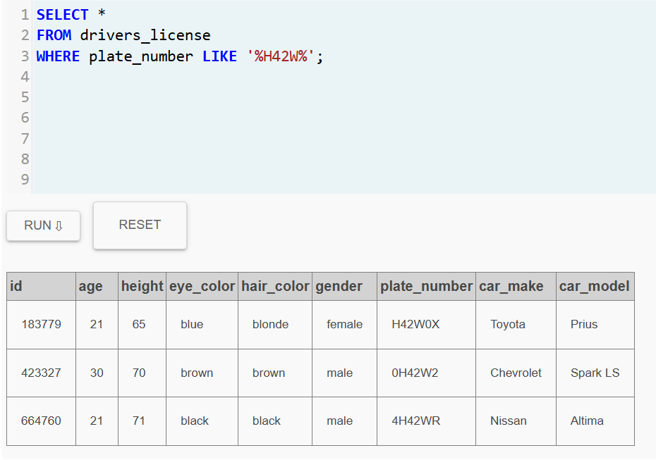

# MURDER MISTERY

<b>CONSULTA 1:</b> Busco el informe del crimen

<b>CONSULTA 2:</b> Busco a los testigos según la información que me facilitan en el informe

<b>CONSULTA 3:</b> Busco las entrevistas gracias a los IDs

<b>CONSULTA 4:</b> Busco a los miembros gold del gimnasio

<b>CONSULTA 5:</b> Investigo que miembros gold acudieron al gimnasio el 9 de enero de 2018

<b>CONSULTA 6:</b> Reviso las matriculas H42W y las comparo con los clientes gold para descubrir al asesino

<b>SOLUCION:</b>
